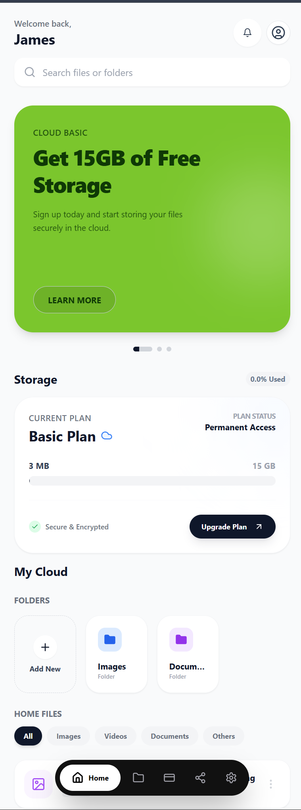
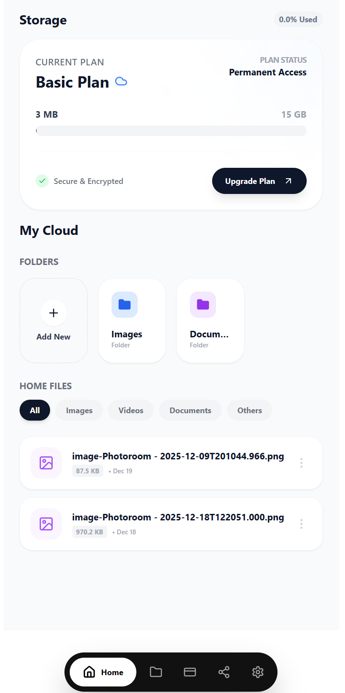
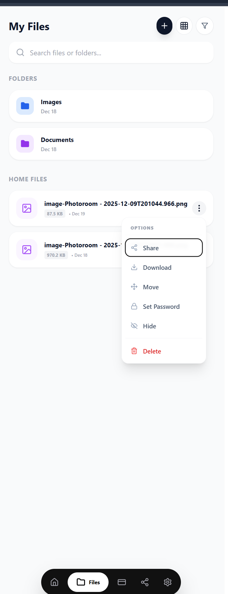
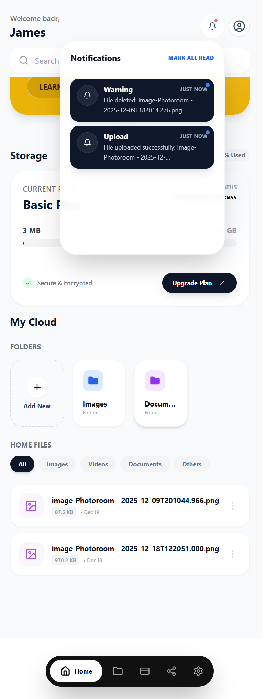
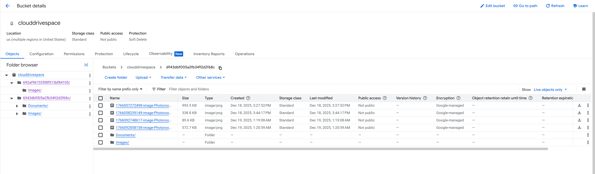
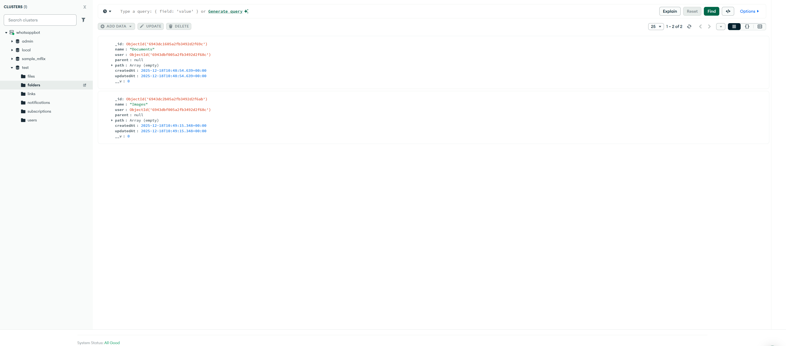

# CloudDrive App ☁️

A secure, cloud-native file management application built with **React, Node.js, MongoDB, and Google Cloud Storage**.

This project focuses on **real-world security, scalability, and clean architecture**, rather than demo-level features.

> **Current Status:**  
> ✅ Phase 1 – Completed  
> 🛠 Phase 2 – In Progress  
> 📱 Phase 3 – Planned  

---

## 📸 Application Preview

> Screenshots represent the actual working system (UI + backend + cloud storage).

### 🏠 User Dashboard

- Personalized user home
- Real-time storage quota usage
- Quick access to folders and files

---

### 📁 File & Folder Management

- Folder creation
- File upload & listing
- File size, date, and type indicators

---

### ⚙️ File Actions

- Preview
- Download
- Move
- Password protection
- Secure delete

---

### 🔔 Notifications

- Upload & delete events
- Read / unread status
- Quick clear notifications

---

### ☁️ Cloud Storage Structure (GCP)

- Fully private Google Cloud Storage bucket
- User-isolated storage paths
- No public object exposure
- All file access routed via backend APIs

---

### 🗄 Database Structure (MongoDB)

**Collections:**
- users
- files
- folders
- notifications
- links (reserved for secure sharing)

Passwords are **hashed** and never stored in plaintext.

---

## ✅ Phase 1 – Completed Features

### 🔐 Authentication & Security
- User signup & login
- Secure password hashing
- Change password functionality
- Authentication middleware for protected APIs

---

### 👤 User-Based Dashboard
- Personalized home screen
- User-specific data rendering
- Real-time storage quota calculation

---

### 🗂 File & Folder Management
- Folder creation
- File upload to Google Cloud Storage
- File preview & download
- Move files between folders
- Secure delete (database + cloud sync)

---

### 🔍 Search & Filters
- Search files & folders by name
- Filter by:
  - Files / Folders
  - File type
  - Date modified

---

### 🔐 File-Level Protection
- Password-protected files
- Authentication required for:
  - Preview
  - Download
  - Delete

---

### 🔔 Notifications
- Upload & delete notifications
- Stored in database
- Read / unread tracking
- Quick clear option

---

### 📊 Storage Quota Management
- Real-time usage tracking
- Auto-update on upload & delete
- Displayed instantly in UI

---

## 🧰 Tech Stack

- **Frontend:** React
- **Backend:** Node.js (Express)
- **Database:** MongoDB
- **Storage:** Google Cloud Storage
- **Cloud Platform:** Google Cloud Platform (GCP)

---

## 🔜 Phase 2 – Secure Sharing & API Hardening (In Progress)

- Secure file sharing links
- Password-protected & expiring links
- Permission-based access (view / download)
- JWT-based API authentication
- Rate limiting & request validation
- File activity & audit logs
- Nested folder system with breadcrumbs

---

## 🔮 Phase 3 – Native App & Production Deployment (Planned)

- Native mobile app (React Native / Hybrid)
- Production deployment on GCP
- Monitoring & performance analytics
- Subscription plans & usage limits
- Improved mobile-first UX

---

## 🔒 Source Code Policy

Source code is currently **private** while core features and
security mechanisms are being finalized.

This repository documents:
- Architecture
- Features
- Development roadmap

Code publication will be considered after Phase 2 stabilization.

---

## 📌 Note

This is a **production-oriented cloud application**, not a tutorial project.  
Design decisions prioritize **security, isolation, and scalability**.
